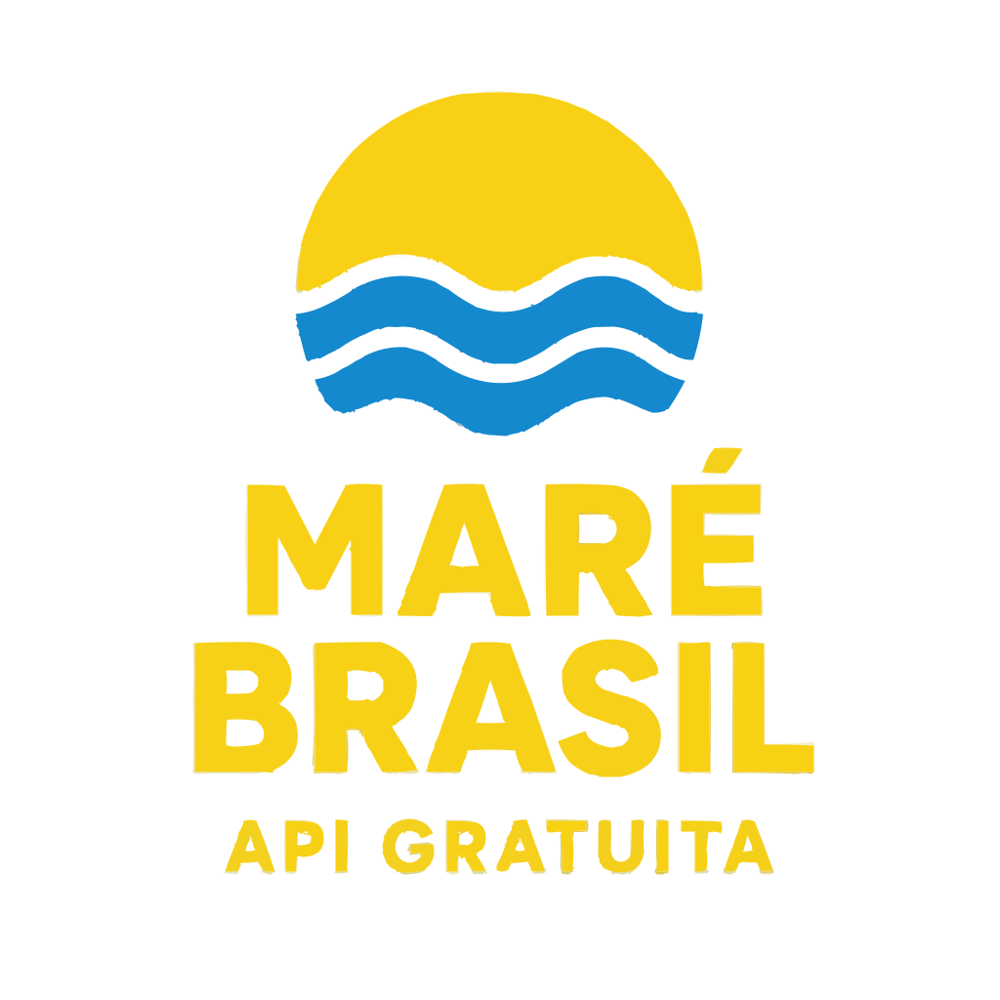

# Tábua de Marés – API Brasileira



Uma API pública para consultar dados precisos de marés em todo o litoral brasileiro. Interface REST simples, sem necessidade de chave de API, com cobertura nacional e exemplos práticos.

- Site oficial: https://tabuamare.devtu.qzz.io/
- Documentação: `/docs`
- Playground: `/playground`
- Apoiar o projeto: `/apoiar`

## Recursos

- Dados precisos e atualizados de marés.
- Interface REST simples e fácil de integrar.
- Cobertura nacional (todos os estados costeiros do Brasil).
- Uso livre, sem autenticação.
- Banco SQLite atualizado do ano corrente, com dados reais utilizados em produção, disponível para utilização em seus próprios projetos.
- Consulta por geolocalização: obtenha a tábua de maré informando latitude, longitude e estado, sem precisar conhecer o porto.

## Base de API

- Prefixo: `/api/v1`

## Como usar a API

Para saber como utilizar a API, incluindo todos os endpoints disponíveis e estrutura de resposta, acesse: **https://tabuamare.devtu.qzz.io/docs**

### Principais Endpoints

- `GET /api/v1/states`
  - Lista as siglas dos estados costeiros disponíveis.
  - Exemplo: `curl -X GET "http://localhost:3330/api/v1/states"`

- `GET /api/v1/harbor_names/{state}`
  - Lista os nomes dos portos de um estado.
  - Parâmetro `state`: sigla do estado em minúsculas (`pb`, `rj`, `sp`).
  - Exemplo: `curl -X GET "http://localhost:3330/api/v1/harbor_names/pb"`

- `GET /api/v1/harbors/{ids}`
  - Retorna dados de um ou mais portos por ID.
  - Parâmetro `ids`: lista no formato `[1,2,3]`.
  - Exemplo: `curl -X GET "http://localhost:3330/api/v1/harbors/[1,2,3]"`

- `GET /api/v1/tabua-mare/{harbor}/{month}/{days}`
  - Tábua de maré para um porto específico.
  - Parâmetros: `harbor` (ID), `month` (`1-12`), `days` (ex.: `[1,2,10-30]`).
  - Exemplo: `curl -X GET "http://localhost:3330/api/v1/tabua-mare/1/1/[1,2,3]"`

- `GET /api/v1/nearested-harbor/{state}/{lat_lng}`
  - Porto mais próximo dentro do estado informado.
  - Parâmetros: `state` (sigla minúscula), `lat_lng` como string no formato `[lat,lng]`.
  - Exemplo: `curl -X GET "http://localhost:3330/api/v1/nearested-harbor/pb/[-7.11509,-34.864]"`

- `GET /api/v1/nearest-harbor-independent-state/{lat_lng}`
  - Porto mais próximo sem limitar por estado.
  - Parâmetros: `lat_lng` como string no formato `[lat,lng]`.
  - Exemplo: `curl -X GET "http://localhost:3330/api/v1/nearest-harbor-independent-state/[-7.11509,-34.864]"`

### Obter tábua de maré por geolocalização

Agora é possível consultar a tábua de maré sem saber o porto, informando apenas as coordenadas geográficas (latitude e longitude) e a sigla do estado. A API identifica o porto mais próximo dentro do estado e retorna a tábua de maré para o período solicitado.

- Endpoint: `GET /api/v1/geo-tabua-mare/{lat_lng}/{state}/{month}/{days}`
- Parâmetros:
  - `lat_lng`: string no formato `[lat,lng]` (ex.: `[-7.11509,-34.864]`)
  - `state`: sigla do estado em minúsculas (ex.: `pb`, `rj`, `sp`)
  - `month`: mês desejado (`1-12`)
  - `days`: dias no formato de array, podendo combinar dias específicos e intervalos (ex.: `[1,2,10-30]`)

Exemplo de requisição:

```
curl -X GET "http://localhost:3330/api/v1/geo-tabua-mare/[-7.11509,-34.864]/pb/1/[1,2,3]"
```

Observações:
- O cálculo do porto é feito com base na menor distância às coordenadas fornecidas, respeitando o estado informado.
- O formato de `days` aceita combinações como `[1,5-13,27]`.

## Limites e uso

- Uso livre: não é necessária chave de API.
- Limite: 500 requisições por minuto por IP.

## Executando localmente

### Pré-requisitos

- **V Language**: Instale seguindo as instruções em https://github.com/vlang/v#installing-v-from-source
- **PostgreSQL**: Banco de dados necessário para armazenar os dados de marés. (Como instalar https://modules.vlang.io/db.pg.html)
- **Arquivo .env**: Configure as variáveis de ambiente (veja seção abaixo)

> **Observação**: O projeto utiliza PostgreSQL em produção, mas ofereço um banco SQLite com dados atualizados do ano corrente. O banco de dados está disponível para facilitar testes locais e desenvolvimento.

### Configuração do ambiente

1. Copie o arquivo `.env.template` para `.env`:

```bash
cp .env.template .env
```

2. Configure as seguintes variáveis no arquivo `.env`:

```
DB_DATABASE=nome_do_banco
DB_USER=usuario_do_banco
DB_HOST=localhost
DB_PASS=senha_do_banco
DB_PORT=5432
NEW_RELIC_KEY=CHAVE
URL_ENV=http://localhost:3330
```

### Desenvolvimento

Execute com V informando a porta:

```
v run . 3330
```

A aplicação iniciará e servirá:

- API em `http://localhost:3330/api/v1`
- Páginas: `http://localhost:3330/`, `/docs`, `/playground`, `/apoiar`

### Produção (Docker Compose)

1. Copie o arquivo `.env.template` para `.env` e ajuste variáveis conforme necessário.
2. Construa e suba os serviços:

```
docker compose up -d --build
```

- Nginx é configurado automaticamente a partir de `nginx/`.
- Variável `PORT` controla a porta externa (padrão `8080`).
- Opcional: `CLOUDFLARE_TUNNEL_TOKEN` para habilitar Cloudflare Tunnel.

## Apoie o projeto

Você pode apoiar este projeto de várias formas:

- **Financeiramente**: Acesse https://tabuamare.devtu.qzz.io/apoiar para contribuir e ajudar a pagar uma VPS melhor
- **Desenvolvimento**: Crie issues, pull requests ou contribua com código
- **Divulgação**: Compartilhe o projeto com outros desenvolvedores

## Contribuindo

- Issues e pull requests são bem-vindos.
- Mantenha o estilo do código e a organização existente.

## Licença

Este projeto está licenciado sob a MIT License. Consulte o arquivo `LICENSE` para os termos completos.
